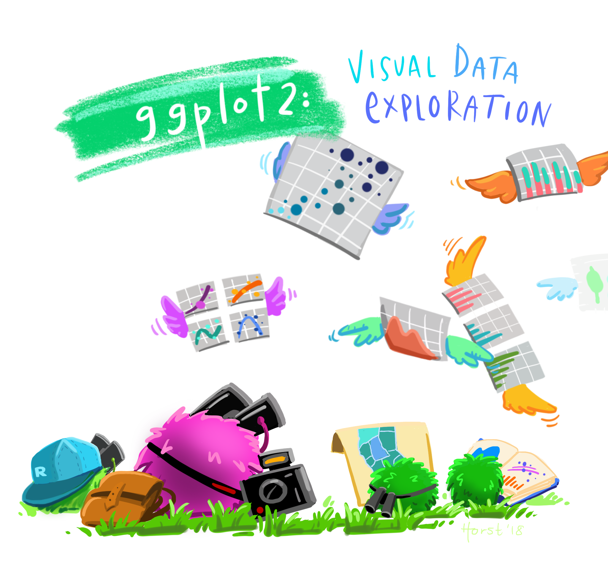

## 1.1 Learning Outcome

In this chapter, you will learn the basic principles and essential components of `ggplot2`. At the same time, you will gain hands-on experience on using these components to plot statistical graphics based on the principle of Layered Grammar of Graphics. By then end of this chapter you will be able to apply the essential graphical elements provided by ggplot2 to create elegant and yet functional statistical graphics.

## 1.2 Getting started

### 1.2.1 Installing and loading the required libraries

Before we get started, it is important for us to ensure that the required R packages have been installed. If yes, we will load the R packages. If they have yet to be installed, we will install the R packages and load them onto R environment.

::: {.callout-note}
The code chunk below assumes that you already have the `pacman` package installed.
:::

```{r}
pacman::p_load(tidyverse)
```

### 1.2.2 Importing data
- The code chunk below imports exam_data.csv into R environment by using `read_csv()` function of readr package.
- readr is one of the tidyverse package.
```{r}
exam_data <- read.csv("data/Exam_data.csv")
```
- Year end examination grades of a cohort of primary 3 students from a local school.
- There are a total of seven attributes. Four of them are categorical data type and the other three are in continuous data type.
  - The categorical attributes are: ID, CLASS, GENDER and RACE.
  - The continuous attributes are: MATHS, ENGLISH and SCIENCE.
  
## 1.3 Introducing ggplot
ggplot2 is an R package for **declaratively** creating **data-driven** graphics based on ***The Grammar of Graphics***.


It is also part of the tidyverse family specially designed for visual exploration and communication.

For more details, visit ```markdown
[ggplot2 link](https://ggplot2.tidyverse.org)

### 1.3.1 R Graphics VS ggplot
```{r}
hist(exam_data$MATHS)
```

```{r}
ggplot(data=exam_data)
```

```{r}
ggplot(data=exam_data, 
       aes(x= MATHS))
```

```{r}
ggplot(data=exam_data, 
       aes(x=RACE)) +
  geom_bar()
```

```{r}
ggplot(data=exam_data, 
       aes(x = MATHS)) +
  geom_dotplot(dotsize = 0.5)
```

```{r}
ggplot(data=exam_data, 
       aes(x = MATHS)) +
  geom_dotplot(binwidth=2.5,         
               dotsize = 0.5) +      
  scale_y_continuous(NULL,           
                     breaks = NULL)  
```

```{r}
ggplot(data=exam_data, 
       aes(x = MATHS)) +
  geom_histogram()       
```

```{r}
ggplot(data=exam_data, 
       aes(x= MATHS)) +
  geom_histogram(bins=20,            
                 color="black",      
                 fill="light blue")  
```

```{r}
ggplot(data=exam_data, 
       aes(x= MATHS, 
           fill = GENDER)) +
  geom_histogram(bins=20, 
                 color="grey30")
```

```{r}
ggplot(data=exam_data, 
       aes(x = MATHS)) +
  geom_density()           
```

```{r}
ggplot(data=exam_data, 
       aes(x = MATHS, 
           colour = GENDER)) +
  geom_density()
```

```{r}
ggplot(data=exam_data, 
       aes(y = MATHS,       
           x= GENDER)) +    
  geom_boxplot()            
```

```{r}
ggplot(data=exam_data, 
       aes(y = MATHS, 
           x= GENDER)) +
  geom_boxplot(notch=TRUE)
```

```{r}
ggplot(data=exam_data, 
       aes(y = MATHS, 
           x= GENDER)) +
  geom_violin()
```

```{r}
ggplot(data=exam_data, 
       aes(x= MATHS, 
           y=ENGLISH)) +
  geom_point()            
```

```{r}
ggplot(data=exam_data, 
       aes(y = MATHS, 
           x= GENDER)) +
  geom_boxplot() +                    
  geom_point(position="jitter", 
             size = 0.5)        
```

```{r}
ggplot(data=exam_data, 
       aes(y = MATHS, x= GENDER)) +
  geom_boxplot()
```

```{r}
ggplot(data=exam_data, 
       aes(y = MATHS, x= GENDER)) +
  geom_boxplot() +
  stat_summary(geom = "point",       
               fun = "mean",         
               colour ="red",        
               size=4)               
```

```{r}
ggplot(data=exam_data, 
       aes(y = MATHS, x= GENDER)) +
  geom_boxplot() +
  geom_point(stat="summary",        
             fun="mean",           
             colour="red",          
             size=4)          
```

```{r}
ggplot(data=exam_data, 
       aes(x= MATHS, y=ENGLISH)) +
  geom_point() +
  geom_smooth(size=0.5)
```

```{r}
ggplot(data=exam_data, 
       aes(x= MATHS, 
           y=ENGLISH)) +
  geom_point() +
  geom_smooth(method=lm, 
              linewidth=0.5)
```

```{r}
ggplot(data=exam_data, 
       aes(x= MATHS)) +
  geom_histogram(bins=20) +
    facet_wrap(~ CLASS)
```

```{r}
ggplot(data=exam_data, 
       aes(x= MATHS)) +
  geom_histogram(bins=20) +
    facet_grid(~ CLASS)
```

```{r}
ggplot(data=exam_data, 
       aes(x=RACE)) +
  geom_bar()
```

```{r}
ggplot(data=exam_data, 
       aes(x=RACE)) +
  geom_bar() +
  coord_flip()
```

```{r}
ggplot(data=exam_data, 
       aes(x= MATHS, y=ENGLISH)) +
  geom_point() +
  geom_smooth(method=lm, size=0.5)
```

```{r}
ggplot(data=exam_data, 
       aes(x= MATHS, y=ENGLISH)) +
  geom_point() +
  geom_smooth(method=lm, 
              size=0.5) +  
  coord_cartesian(xlim=c(0,100),
                  ylim=c(0,100))
```

```{r}
ggplot(data=exam_data, 
       aes(x=RACE)) +
  geom_bar() +
  coord_flip() +
  theme_gray()
```

```{r}
ggplot(data=exam_data, 
       aes(x=RACE)) +
  geom_bar() +
  coord_flip() +
  theme_classic()
```

```{r}
ggplot(data=exam_data, 
       aes(x=RACE)) +
  geom_bar() +
  coord_flip() +
  theme_minimal()
```

```{r}

```

```{r}

```


